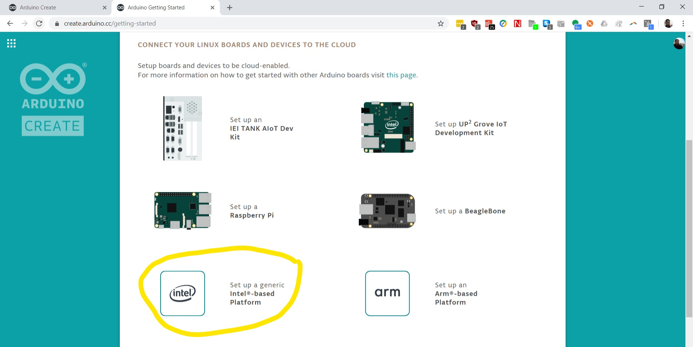

# Installing the Arduino Create Agent

The Arduino Create Agent is a small service that connects your development computer to your prototyping board. Even though the development environment is a web application in the cloud, you still must have the prototyping board and your development computer on the same network.

## Installation Steps
To install the Arduino Create Agent, you must first go to [http://create.arduino.cc/](http://create.arduino.cc/) and click on the **My Devices** link.

 Click on **Add a new Device**.
 Note:  If you don’t already have an Arduino Create account, follow the onscreen instructions to sign up. You'll need to activate your account and log into the site using your new account.

Select the **Next** button.

 Select the **Set up a generic Intel(r) based platform** link.

 The Arduino Create website will detect your OS and begin downloading the OS specific Arduino Create Agent.

Install the Agent and you will see if appear in the system tray of UI menu of your operating system. **Please note that if you are using the Up2 Board itself as the development platform then the Arduino Create Agent is already pre-installed for you.**

In some browsers, the Arduino Web Editor may ask you to install extra certificates.

## Name Your Computer
Lastly, you will be asked to name Your Up2 board.

# Register Up2 Board with Arduino Create

Follow the steps online to register your Up2 Board.

