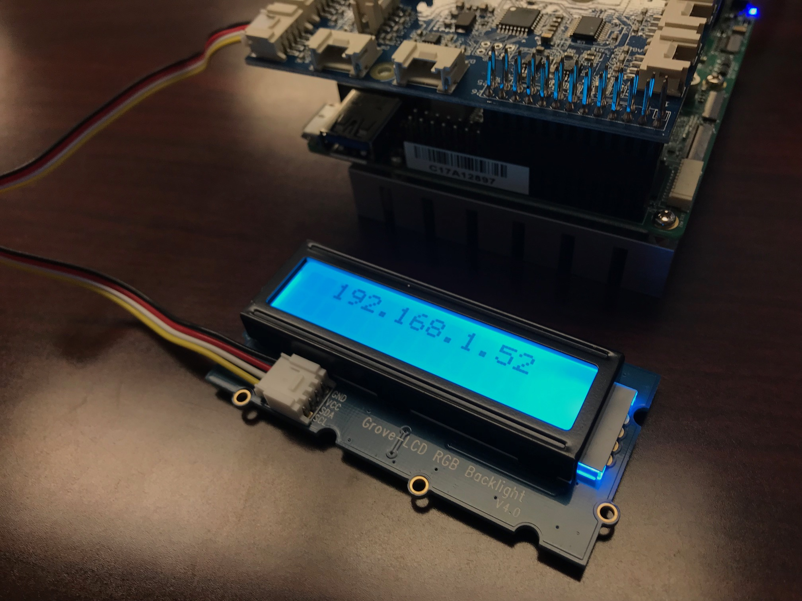
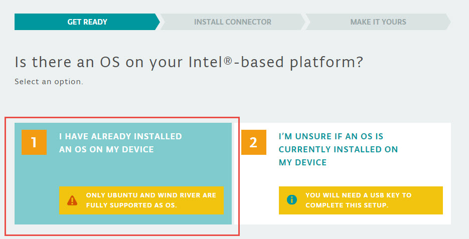
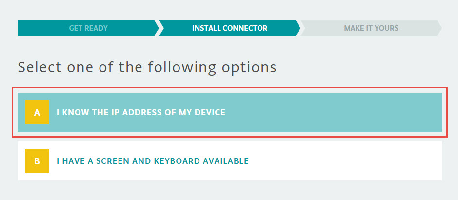
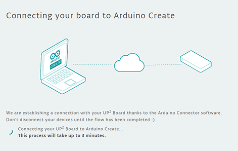

[Industrial IoT Workshop](https://github.com/SSG-DRD-IOT/Industrial-IoT-Workshop) > [UP2 Getting Started Guide](README.md) > [Install the Arduino Create Agent](setup-arduino-create-agent.md)

# Installing the Arduino Create Agent

The Arduino Create Agent is a small service that connects your development computer to your prototyping board. Even though the development environment is a web application in the cloud, you still must have the prototyping board and your development computer on the same network.

***Note***: If you are having problems with Arduino Create Agent installation, because of administrative rights of your PC, please conitue with [Connecting over IP Networking](https://github.com/SSG-DRD-IOT/lab-up2-setup/blob/milano-workshop/setup-arduino-create-agent.md#connecting-over-ip-networking) section or you can skip to [Installation Steps](https://github.com/SSG-DRD-IOT/lab-up2-setup/blob/milano-workshop/setup-arduino-create-agent.md#installation-steps) for Arduino Create Agent installations.

## Connecting over IP Networking
The IP address of your board should be displayed on the LCD.



Go to https://create.arduino.cc/getting-started/intel-platforms, and select **1. I have already installed an OS on my device**



Then select **I know the IP address of my device** and enter your IP address that is on your LCD.

The username is **upsquared** and the password is **upsquared**





If you find yourself on this "Connecting your board to Arduino Create" screen for than 3 minutes, check your connections (Ethernet, micro USB, power) and try again.  If that doesn’t work, try these troubleshooting tips:

* Completely restart your UP² board by removing the power supply and the micro USB cable. Then power it back on. Wait a couple of minutes for it to boot, then try to connect to Arduino Create again.
* If your host computer has Windows*, minimize all windows to make sure you haven’t missed a pop-up message asking you to install a driver.
* Force a "hard refresh" on the Arduino web page. For example, if you’re on Chrome*:
* For Windows, press Ctrl+Shift+R.
* For macOS*, hold Shift and click the Reload button.

**Note:** If you have issues connecting to board without installing Arduino Create Agent with only writing the IP address, please try the next option after connecting through UP2 board terminal with SSH. 

```bash
export id=odundar:ad3c237e-4052-407c-951d-46e8d4d0b3ff

wget -O install.sh https://downloads.arduino.cc/tools/feed/arduino-connector/arduino-connector.sh

chmod +x install.sh

./install.sh
```

**NOTE:** Arduino Create Agent Installation at below just for your information, inside the lab sections, we recommend skipping arduino create agent installation.

## Installation Steps
To install the Arduino Create Agent, you must first go to [http://create.arduino.cc/](http://create.arduino.cc/) and click on the **My Devices** link.

 Click on **Add a new Device**.
 Note:  If you don’t already have an Arduino Create account, follow the onscreen instructions to sign up. You'll need to activate your account and log into the site using your new account.


Select the **Next** button.

 Select the **Set up the Arduino Plugin to start coding online** link.

 

 The Arduino Create website will detect your OS and begin downloading the OS specific Arduino Create Agent.

Install the Agent and you will see if appear in the system tray of UI menu of your operating system. **Please note that if you are using the Up2 Board itself as the development platform then the Arduino Create Agent is already pre-installed for you.**

In some browsers, the Arduino Web Editor may ask you to install extra certificates. 

## Name Your Computer
Lastly, you will be asked to name Your Up2 board.

## Now You Can Begin Coding

Your board is ready to use with Arduino Cloud IDE. You can go to [Sensors and Actuators](https://github.com/SSG-DRD-IOT/toc-sensors/tree/milano-workshop) lab section to complete any of the labs.

