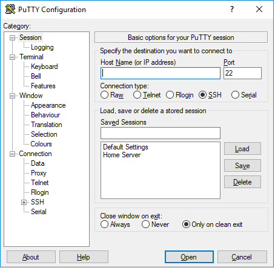
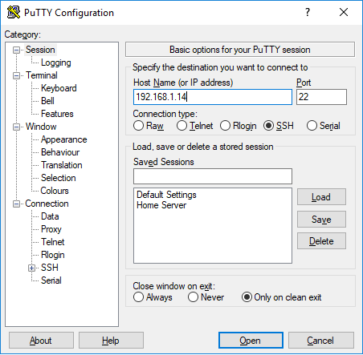
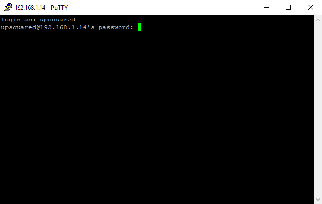

[Industrial Iot Workshop](https://github.com/SSG-DRD-IOT/Industrial-IoT-Workshop) > [Connect to UP2 Board](up2-board-connect.md)

# UP2 Board Remote Connection with SSH

In this guide, we will follow up after board setup to connect UP2 board with ssh.

If you are using Windows please install [PuTTY](https://putty.org), if you are using Linux or Mac OS X, you can use the terminal for ssh connection.

### Windows 

  - Run PuTTY after installation.

 

  - Write IP Address of UP2 Board

 

  - Then, for username and password write **upsquared**

 

### Linux / Mac OSX

Open Terminal:

`$ ssh upsquared@<up2_ip_address>`

for password, write **upsquared** again

### Using Terminal of UP2 Board

All workshop content is located under:

`$ cd /home/upsquared/Desktop/Lab\ Answers`

### Next Step

[Setup Arduino Create Agent](setup-arduino-create-agent.md)
